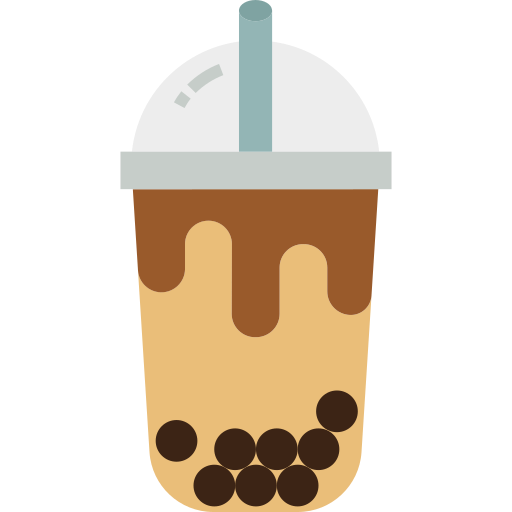
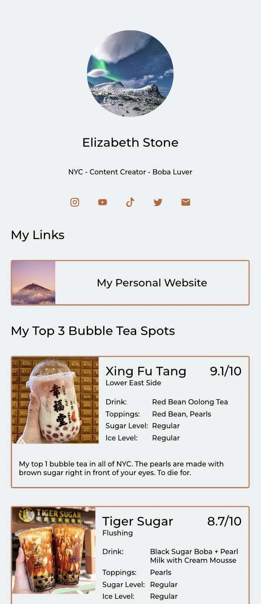

  

<h3 align="center">BobaLevel</h3>

<!-- ABOUT THE PROJECT -->

## About The Project

This is a link-in-bio tool for boba lovers. Think linktree, but for bubble tea. Share your favorite bubble tea spots, drinks, and customizations with all your followers. Include links to all your socials and many other features.

Check out my own page: https://bobalevel.com/peterfeng/

### Built With

- [![Next][Next.js]][Next-url]
- [![React][React.js]][React-url]
- [![SpringBoot][Springboot]][Spring-url]
- [![MongoDB][MongoDB]][Mongo-url]

<!-- GETTING STARTED -->

## Getting Started

1. Create your free account on https://bobalevel.com/signup
2. Add a picture, a description, and all your links in the settings.
3. Add titles, links, and reviews for your top boba spots.
4. Share your page with friends, family, and followers.

<!-- MARKDOWN LINKS & IMAGES -->

[Next.js]: https://img.shields.io/badge/next.js-000000?style=for-the-badge&logo=nextdotjs&logoColor=white
[Next-url]: https://nextjs.org/
[React.js]: https://img.shields.io/badge/React-20232A?style=for-the-badge&logo=react&logoColor=61DAFB
[React-url]: https://reactjs.org/
[Springboot]: https://img.shields.io/badge/SpringBoot-6DB33F?style=for-the-badge&logo=Spring&logoColor=white
[Spring-url]: https://spring.io/projects/spring-boot
[MongoDB]: https://img.shields.io/badge/-MongoDB-05122A?style=for-the-badge&logo=mongodb
[Mongo-url]: https://www.mongodb.com/
